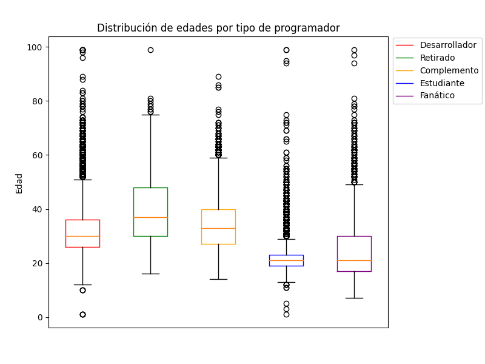
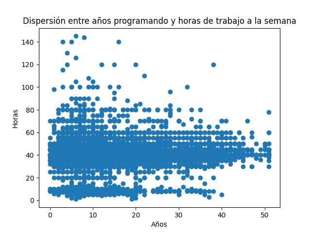
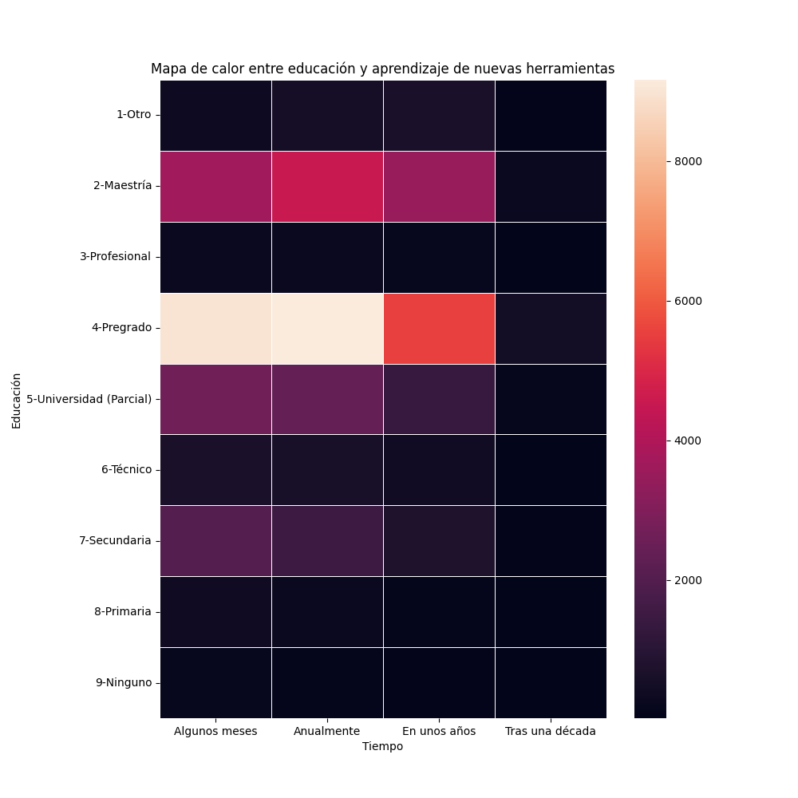
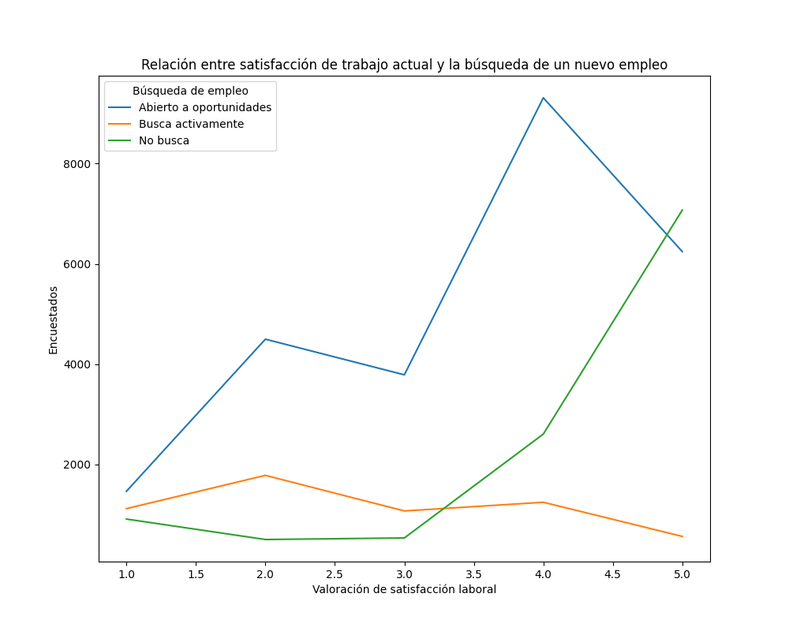

# Indicadores de Correlación en Python

## Introducción

Stack Exchange es una red de sitios de preguntas/respuestas sobre temas de diferentes campos, donde cada sitio se enfoca en un área en particular. Stack Overflow es uno de los sitios más activos de esta red, siendo su enfoque la programación en general.

Este documento se enfocará en estudiar la percepción de los participantes sobre su capacidad de aprendizaje y su satisfacción laboral.

## Requerimientos

* [Python](https://www.python.org/)
* [Numpy](https://numpy.org/)
* [Pandas](https://pandas.pydata.org/)
* [Matplotlib](https://matplotlib.org/)
* [Seaborn](https://seaborn.pydata.org/)

## Dataset

El conjunto de datos seleccionado corresponde a los resultados de la encuesta de Stack Overflow realizada en el año 2020, que puede ser consultada en [este enlace](https://www.kaggle.com/datasets/vijay12345/stack-overflow-developer-survey-2020?select=survey_results_public.csv).

La encuesta fue respondida por aproximadamente 65000 participantes y se divide en seis secciones:

* Información básica de la persona
* Educación, trabajo y carrera
* Tecnología y cultura tecnológica
* Comunidad y uso de Stack Overflow
* Información demográfica
* Preguntas finales (percepción de la encuesta)

De esto se compila un total de 61 columnas, que puede observar [aquí](https://github.com/amasrie/indicadores_python/tree/master/dataset/survey_results_public.csv). Puede observar el listado de preguntas y el campo correspondiente a cada columna en el dataset anteriormente comentado desde [este enlace](https://github.com/amasrie/indicadores_python/tree/master/dataset/survey_results_schema.csv).

## Distribución de edades por tipo de programador

Existen cinco clasificaciones para tipos de programador, a saber:

* Desarrollador: Desarrollador por profesión
* Retirado: Persona que solía ser desarrollador por profesión, pero se ha retirado
* Complemento: Persona que suele aplicar habilidades de programación en algunas de sus asignaciones laborales
* Estudiante: Persona que se encuentra en etapa de aprendizaje
* Fanático: Persona que programa por placer

En la gráfica a continuación se puede observar distintos diagramas de caja, representando cada una de las categorías anteriormente descritas y la distribución de las edades de los participantes (ignorando aquellas personas que hayan indicado tener más de 120 años):



De esto se puede observar que:

* La categoría de estudiantes es la más joven, con una edad aproximada de 21 años.
* Si bien los fanáticos tienen una mediana similar a los estudiantes, su rango es mucho más amplio, dando a entender que la distribución de edades está más dispersa en este caso.
* Las personas que desarrollan profesionalmente, así como aquellos que la usan como actividad complementaria, poseen un rango relativamente similar (edades entre los 26 y los 40 años), sin embargo, en el caso de los profesionales la dispersión es menor, dando a entender que los desarrolladores se retiran mucho más jóvenes.
* La mediana de los desarrolladores profesionales corresponde con el primer cuartil de los retirados (edad de 30 años).
* Se puede apreciar una gran cantidad de valores atípicos en los cinco gráficos, sin embargo, algunos alcanzan los cien años mientras otros apuntan a una edad exageradamente baja. Si bien es comprensible que existan estudiantes y fanáticos que a temprana edad estén aprendiendo programación, así como personas retiradas con más de 80 años, resulta muy extraño que los profesionales tengan una cota inferior tan baja.

## Dispersión entre años programando y horas de trabajo a la semana

Se procuró estudiar si existía algún tipo de correlación entre la cantidad de años trabajando como profesional de programación y la cantidad de horas de trabajo semanal, tomando como premisa inicial que, mientras mayor sea la cantidad de tiempo dedicada a la programación, menor esfuerzo (y por lo tanto, menor tiempo) se requeriría para realizar las actividades de dicho rol. 



Se procuró filtrar de modo que solamente se consideren aquellas personas que hayan indicado ser desarrolladores por profesión, con edad menor a 150 años, con empleo a tiempo completo e incluso por países específicos, pero el nivel de correlación es muy bajo (aproximadamente 0.06) e incluso menor a medida que se aplicaban más filtros. Como se puede observar en la gráfica anterior, se puede concluir que no hay correlación aparente entre estas variables.

## Relación entre el nivel de educación alcanzado y el tiempo invertido en aprender nuevas herramientas

Se consultó a los encuestados aproximadamente cuánto tiempo requerirían para aprender una nueva tecnología. Las opciones disponibles eran:

* Algunos meses
* Un año
* Algunos años
* Al menos diez años

Adicionalmente, tamibén se preguntó por el nivel educativo de los participantes, siendo las opciones:

* Ninguno: Sin educación
* Primaria: Educación básica
* Secundaria: Educación media
* Universidad (Parcial): Persona que ingresó a la universidad, pero no finalizó sus estudios
* Técnico: Título universitario en una carrera de 2-3 años
* Pregrado: Título universitario en una carrera de 4-5 años
* Profesional: Título universitario especial (Ej: leyes, medicina, etc)
* Maestría: Estudios de postgrado
* Otro: Cualquiera que no corresponda a las categorías anteriores

Se indica a continuación el total de registros por cada una de estas categorías, la tabla con la distribución y un mapa de calor entre estas variables:

```
4-Pregrado                 24095
2-Maestría                 12017
5-Universidad (Parcial)     6596
7-Secundaria                4302
6-Técnico                   1690
1-Otro                      1575
8-Primaria                   809
3-Profesional                712
9-Ninguno                    393
```

```
NEWLearn                 Algunos meses  Anualmente  En unos años  Tras una década
EdLevel
1-Otro                             309         541           642               83
2-Maestría                        3671        4554          3490              302
3-Profesional                      247         257           180               28
4-Pregrado                        8966        9163          5506              460
5-Universidad (Parcial)           2688        2393          1374              141
6-Técnico                          632         611           417               30
7-Secundaria                      2030        1450           759               63
8-Primaria                         388         288           115               18
9-Ninguno                          190         109            72               22
```


Se puede apreciar que:

* La mayoría de los encuestados tienen un título universitario (pregrado), habiendo una relación 1:2 contra las personas que han realizado una maestría, 1:4 contra aquellos que no completaron sus estudios universitarios y 1:6 contra las personas que sólo completaron la secundaria.
* El resto de las categorías posee muy pocos miembros, haciendo su evaluación realmente despreciable para los efectos del mapa de calor y dada la gran cantidad de personas con título de pregrado.
* Todas las categorías coinciden en que sólo un pequeño porcentaje (menos del 6% por categoría) afirmó aprender una nueva tecnología tras una década de estudio.
* La única categoría en donde la mayoría indica requerir unos años para aprender una nueva herramienta es "Otro".
* Si bien la diferencia entre los que indican requerir unos meses y los que aseguran que necesitan un año es mínima, la mayoría de los encuestados de título profesional, maestría y pregrado señalan que requieren al menos de un año para dominar una nueva tecnología, mientras que los de nivel técnico, universidad parcial, primaria y secundaria se decantan más a la idea de que sólo de unos meses basatan para adquirir el conocimiento necesario.

## Relación entre satisfacción del trabajo actual y búsqueda de nuevas oportunidades

Se solicitó a los encuestados indicar cuál de las siguientes opciones describe mejor su estado de búsqueda laboral:

* Busca activamente nuevas oportunidades
* No busca activamente, pero está bierto a nuevas oportunidades
* No está interesado en nuevas oportunidades laborales

Adicionalmente, se solicitó indicar qué tan satisfecho se encuentra con su trabajo actual:

* 1: Muy insatisfecho
* 2: Insatisfecho
* 3: Neutral
* 4: Satisfecho
* 5: Muy satisfecho

Se adjunta a continuación la distribución de los datos entre estas dos variables:

```
JobSeek  Abierto a oportunidades  Busca activamente  No busca
JobSat
1                           1462               1116       908
2                           4497               1780       500
3                           3786               1070       531
4                           9313               1243      2604
5                           6244                562      7074
```



Se puede apreciar con los datos anteriores que:
* En líneas generales, la mayoría de los encuestados (aproximadamente 27000) están satisfechos con su trabajo actual, pero a su vez una mayoría de aproximadamente 25000 personas también está abierto a nuevas oportunidades laborales.
* Más del 80% de las personas que no bsucan nuevas oportunidades demuestran estar satisfechos con su trabajo actual.
* El 50.1% de las personas que buscan un nuevo trabajo tienen opiniones negativas sobre su trabajo actual, mientras que el 18.5% de este grupo no está satisfecha ni insatisfecha.
* Muy similar al caso anterior, aproximadamente un 54% de las personas abiertas a nuevas oportunidades laborales se sienten satisfechas con su trabajo actual.

